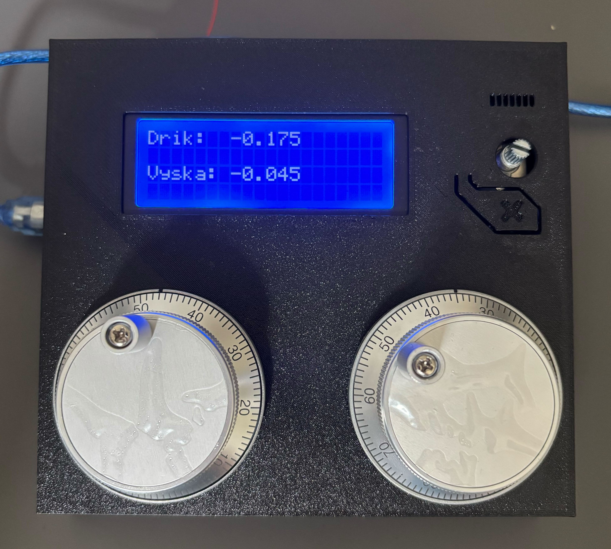

# LinuxCNC Tool Correction Panel

## Overview



*LinuxCNC Tool Correction Panel with LCD display and rotary encoders*

This project provides an additional box/panel for machining tool correction in LinuxCNC. It's an extension of the original [LinuxCNC_ArduinoConnector](https://github.com/AlexmagToast/LinuxCNC_ArduinoConnector) project, specifically adapted for tool correction applications.

**Important**: This software is NOT intended for timing and safety-critical I/O operations. Do not use it for emergency stops or endstop switches.

## Features
- **Tool shank correction** - using rotary encoder
- **Tool height correction** - using rotary encoder  
- **LCD display** - shows current correction values
- **Automatic correction application** - before running main machining program
- **Correction reset** - display automatically resets after application

## Hardware Requirements
- Arduino Mega 2560
- 2x rotary encoders (for shank and height correction)
- LCD display 20x4 characters
- USB serial connection between Arduino and LinuxCNC

## Installation and Configuration

### 1. Arduino Software
Upload the firmware from `src/` folder to Arduino Mega 2560. The software automatically configures:
- 2 quadrature encoders on pins defined in code
- LCD display for showing correction values
- Serial communication with LinuxCNC

### 2. LinuxCNC Configuration

#### 2.1 Python Connector Installation
Copy the [`linuxcnc/arduino-connector.py`](linuxcnc/arduino-connector.py) file to your LinuxCNC system and make it executable:

```bash
sudo cp linuxcnc/arduino-connector.py /usr/local/bin/
sudo chmod +x /usr/local/bin/arduino-connector.py
```

#### 2.2 INI File Configuration
Edit your existing INI file to add the required variables (see [`linuxcnc/example.ini`](linuxcnc/example.ini)):

```ini
# In the existing [RS274NGC] section, add:
[RS274NGC]
...
HAL_PIN_VARS = 1

# In the existing [HAL] section, add:
[HAL]
TWOPASS = on
...
HALFILE = tool-correction-panel.hal
```

#### 2.3 HAL Configuration
Copy the [`linuxcnc/tool-correction-panel.hal`](linuxcnc/tool-correction-panel.hal) file to your LinuxCNC configuration. This file contains:

- **Shank correction**: Encoder for tool shank correction
  - Encoder connected to `arduino.counter.0`
  - Output value in `corr-drik-enc-diff.out-f`
  - Scale: 0.005 (conversion from encoder pulses to mm)

- **Height correction**: Encoder for tool height correction  
  - Encoder connected to `arduino.counter.1`
  - Output value in `corr-vyska-enc-diff.out-f`
  - Scale: 0.005 (conversion from encoder pulses to mm)

- **Reset signal**: Control from G-code using `motion.digital-out-03`

## Usage

### 1. Setting Corrections
1. Start LinuxCNC with the configured panel
2. LCD display shows current correction values
3. Turn encoders to set desired corrections:
   - **Encoder 1**: Tool shank correction (X-axis)
   - **Encoder 2**: Tool height correction (Z-axis)

### 2. Applying Corrections
Before running your main machining program, call the G-code [`linuxcnc/apply-correction.ngc`](linuxcnc/apply-correction.ngc):

```gcode
; Call correction program
O<apply-correction> call
```

This program automatically:
1. Selects tool T3 and applies basic G43 correction
2. Reads shank correction value from encoder and applies it to the tool
3. Reads height correction value from encoder and applies it to coordinate system
4. Resets values on panel (clears display)

### 3. G-code for Correction Application

The [`linuxcnc/apply-correction.ngc`](linuxcnc/apply-correction.ngc) file contains:

```gcode
G8
G90 G94 G18
G21
G54

; Select right tool
T3 M6 G43
G4 P0.5

; Apply correction shank
#<corr_drik> = [#<_hal[corr-drik-enc-diff.out-f]> / 2]
G10 L1 P3 X[#5401 + #<corr_drik>]
G4 P0.1
G43

; Apply correction height
#<corr_vyska> = #<_hal[corr-vyska-enc-diff.out-f]>
G10 L2 P1 Z[#5223 + 0.005]
G4 P0.1
G54

; Reset correction value on panel
M65 P3
G4 P0.1
M64 P3

M2
```

## Technical Details

### Communication Protocol
The system uses serial communication with protocol: `<Signal><PinNumber>:<PinState>`

**Relevant signals for correction panel:**
- **R** - Quadrature encoders (arduino → linuxcnc)
- **F** - Float variables for LCD (linuxcnc → arduino)  
- **E** - Keep-alive signal (bidirectional)

### HAL Components
The system uses these HAL components:
- **sample_hold**: Captures encoder value on reset pulse
- **scaled_s32_sums**: Calculates relative correction (current - captured value)

### Scales and Conversions
- **Encoder → mm**: 0.005 (200 pulses/revolution, 1mm/revolution)
- **LCD precision**: 3 decimal places
- **Shank correction**: Divided by 2 in G-code for finer adjustment

## Troubleshooting

### Encoders not responding
1. Check encoder connections to Arduino:
   - **Encoder 0** (shank correction): Connect A signal to pin A3, B signal to pin 10
   - **Encoder 1** (height correction): Connect A signal to pin 11, B signal to pin 12
   - Use interrupt-capable pins for best performance (see Arduino Mega interrupt pins: 2, 3, 18, 19, 20, 21)
2. Verify configuration in `arduino-connector.py`:
   ```python
   QuadEncs = 2
   QuadEncSig = [2,2]  # Signal type 2 = position signal (for MPG wheel)
   ```
3. Check pin definitions in `src/main.cpp`:
   ```cpp
   Encoder Encoder0(A3,10);    // Encoder 0: A signal on A3, B signal on pin 10
   Encoder Encoder1(11,12);    // Encoder 1: A signal on pin 11, B signal on pin 12
   ```
4. Verify encoder power supply (typically 5V) and ground connections
5. Check encoder pulse multiplier settings:
   ```cpp
   const int QuadEncMp[] = {4,4};  // 4 electrical impulses per mechanical pulse
   ```

### LCD not displaying values
1. Check LCD variable settings:
   ```python
   LcdFloatVars = 2
   ```
2. Verify HAL connections in `tool-correction-panel.hal`

### G-code not working
1. Check that `HAL_PIN_VARS = 1` is set in INI file
2. Verify correct HAL file is loaded
3. Check tool number (T3) in correction G-code

## Original Project
This project is based on [LinuxCNC_ArduinoConnector](https://github.com/AlexmagToast/LinuxCNC_ArduinoConnector) by Alexander Richter.

The original README with complete Arduino connector documentation is available in the git history of this project.

## License
This program is free software; you can redistribute it and/or modify it under the terms of the GNU General Public License as published by the Free Software Foundation; either version 2 of the License, or (at your option) any later version.

This program is distributed in the hope that it will be useful, but WITHOUT ANY WARRANTY; without even the implied warranty of MERCHANTABILITY or FITNESS FOR A PARTICULAR PURPOSE. See the GNU General Public License for more details.

You should have received a copy of the GNU General Public License along with this program; if not, write to the Free Software Foundation, Inc., 59 Temple Place, Suite 330, Boston, MA 02111-1307 USA.
